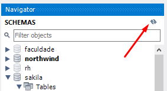
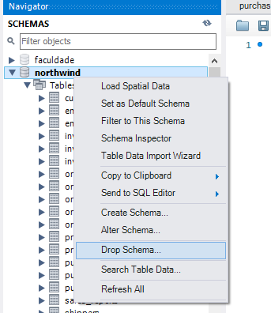

# Projeto All For One

# Habilidades
Nesse projeto procuro:

- Entender o que são bancos de dados
- Entender como a linguagem de consulta estruturada (SQL) é usada
- Compreender como as tabelas se encaixam no conceito de banco de dados
- Montar um ambiente de desenvolvimento local para praticar SQL
- Entender como usar o MySQL Workbench
- Compreender o que é uma query SQL e quais são seus tipos de comando
- Gerar valores com `SELECT`
- Selecionar colunas individualmente com `SELECT`
- Renomear e gerar colunas em uma consulta com `AS`
- Concatenar colunas e valores com `CONCAT`
- Remover dados duplicados em uma consulta com `DISTINCT`
- Contar a quantidade de resultados em uma consulta com `COUNT`
- Limitar a quantidade de resultados em uma consulta com `LIMIT`
- Pular resultados em uma consulta com `OFFSET`
- Ordernar os resultados de uma consulta com `ORDER BY`
- Filtrar resultados de consultas com o `WHERE`
- Utilizar operadores booleanos e relacionais em consultas
- Criar consultas mais dinâmicas e maleáveis com `LIKE`
- Fazer consultas que englobam uma faixa de resultados com `IN` e `BETWEEN`
- Encontrar e separar resultados que incluem datas.
- Inserir dados em tabelas com `INSERT`
- Atualizar dados em tabelas com `UPDATE`
- Apagar dados em tabelas com `DELETE`

# Instruções para restaurar o banco de dados `Northwind`

1. Faça o download do arquivo de backup [aqui](northwind.sql) clicando em "Raw", depois clicando com botão direito e selecionando "Salvar como" para salvar o arquivo em seu computador.
2. Abra o arquivo com algum editor de texto, e selecione todo o conteúdo do arquivo usando `CTRL-A`.
3. Abra o MySQL Workbench.
4. Abra uma nova janela de query e cole dentro dela todo o conteúdo do arquivo `northwind.sql`.
5. Selecione todo o código com o atalho `CTRL-A` e depois clique no icone de trovão para executar a query.

    
6. Aguarde alguns segundos (espere em torno de 30 segundos antes de tentar fazer algo).
7. Clique no botão apontado na imagem a seguir para atualizar a listagem de banco de dados.

    
7. Verifique se o banco restaurado possui todas as seguintes tabelas:

    
8. Clique com botão direito em cada tabela e selecione "Select Rows" e certifique-se que todas as tabelas possuem registros. Caso tenha alguma faltando, faça o passo a seguir. Caso contrário, pode ir para próxima seção.
9. Caso existam tabelas faltando, drope o banco de dados, clicando com o botão direito em cima do banco de dados northwind e selecionando "Drop Schema", e refaça os passos novamente, dessa vez aguardando um tempo maior quando executar o script de restauração.

    

---

## Instruções para testar suas queries

Para executar localmente os testes, é preciso instalar as depedências com `npm i` e escrever o seguinte no seu terminal:
```sh
MYSQL_USER=<SEU_NOME_DE_PESSOA_USUARIA> MYSQL_PASSWORD=<SUA SENHA> HOSTNAME=<NOME_DO_HOST> npm test
```

Ou seja, suponha que para poder acessar a base de dados feita neste projeto você tenha `root` como seu nome de pessoa usuária, `password` como senha e `localhost` como host. Logo, você executaria:
```sh
MYSQL_USER=root MYSQL_PASSWORD=password HOSTNAME=localhost npm test
```

Usando o exemplo anterior de base, suponha que você não tenha setado uma senha para `root`. Neste caso, você executaria:
```sh
MYSQL_USER=root MYSQL_PASSWORD= HOSTNAME=localhost npm test
  ```
Ainda usando o exemplo anterior de base, se você quiser rodar apenas os desafios iniciais você pode colocar `initial` ao final do comando anterior para executar apenas os testes da pasta `sd-09-mysql-all-for-one/tests/initialChallenges.spec.js`, `filter` para `sd-09-mysql-all-for-one/tests/filteringChallenges.spec.js` e assim por diante. No primeiro caso, você executaria:
```sh
MYSQL_USER=root MYSQL_PASSWORD= HOSTNAME=localhost npm test initial
```